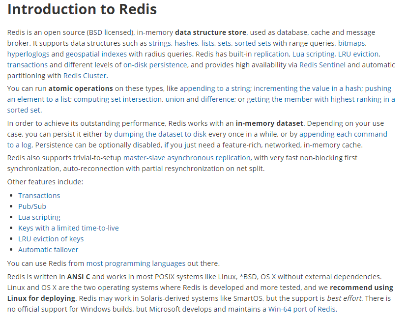
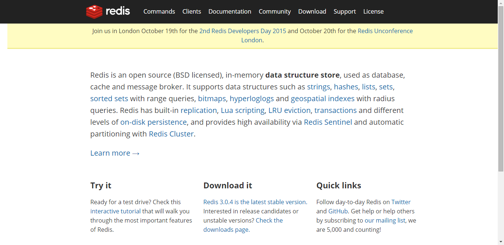
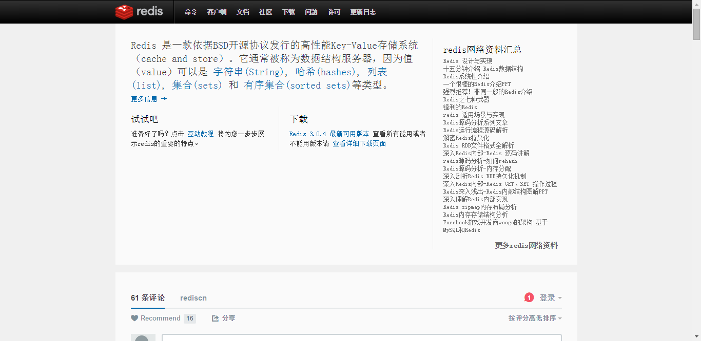

# Redis入门介绍

## 1. 入门概述

### 1.1 是什么

* Redis:REmote DIctionary Server(远程字典服务器)

  
* 是完全开源免费的，用C语言编写的，遵守BSD协议，
  是一个高性能的(key/value)分布式内存数据库，基于内存运行
  并支持持久化的NoSQL数据库，是当前最热门的NoSql数据库之一,
  也被人们称为数据结构服务器

* Redis 与其他 key - value 缓存产品有以下三个特点
  * Redis支持数据的持久化，可以将内存中的数据保持在磁盘中，重启的时候可以再次加载进行使用
  * Redis不仅仅支持简单的key-value类型的数据，同时还提供list，set，zset，hash等数据结构的存储
  * Redis支持数据的备份，即master-slave模式的数据备份

### 1.2 能干嘛

* 内存存储和持久化：redis支持异步将内存中的数据写到硬盘上，同时不影响继续服务
* 取最新N个数据的操作，如：可以将最新的10条评论的ID放在Redis的List集合里面
* 模拟类似于HttpSession这种需要设定过期时间的功能
* 发布、订阅消息系统
* 定时器、计数器

### 1.3 去哪下

* Http://redis.io/

  
* Http://www.redis.cn/

 

### 1.4 怎么玩

* 数据类型、基本操作和配置
* 持久化和复制，RDB/AOF
* 事务的控制
* 复制
* ......

