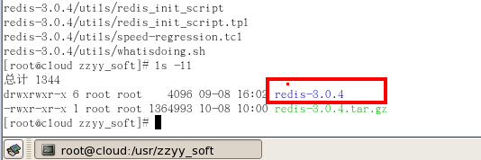
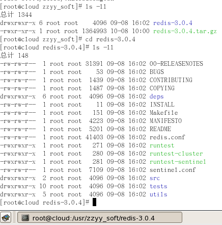
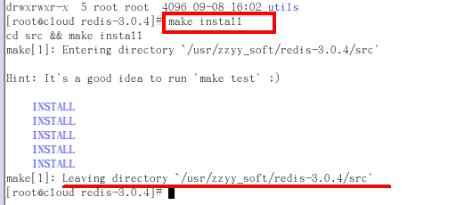
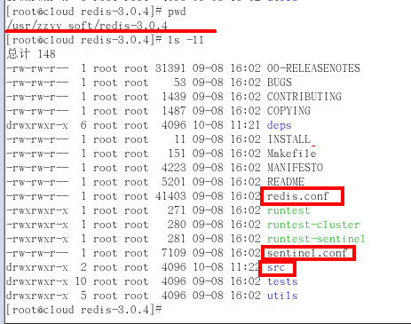
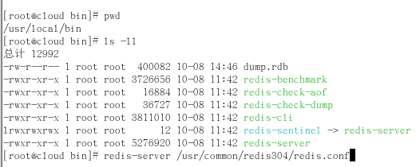
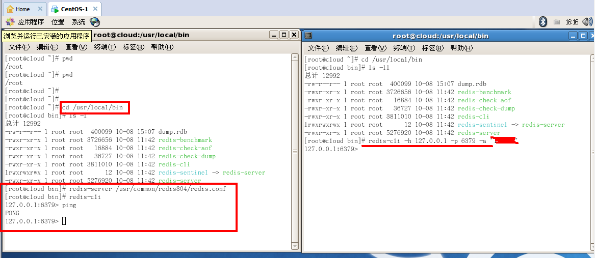
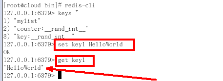
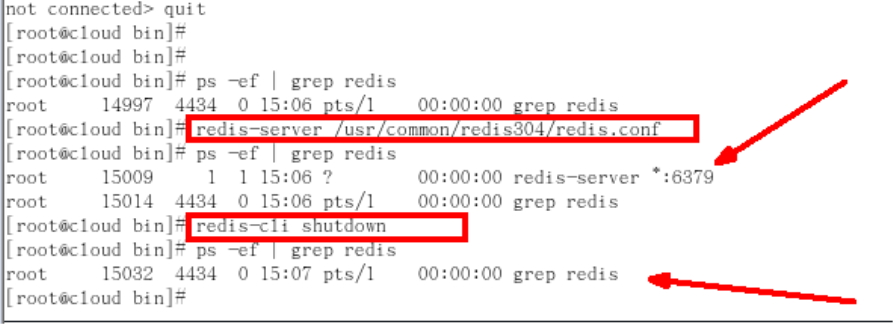

# Redis的安装

## Linux版安装

1. 下载获得redis-3.0.4.tar.gz后将它放入我们的Linux目录/opt

2. /opt目录下，解压命令:tar -zxvf redis-3.0.4.tar.gz

3. 解压完成后出现文件夹：redis-3.0.4

  
4. 进入目录:cd redis-3.0.4

  
5. 在redis-3.0.4目录下执行make命令
  * 运行make命令时故意出现的错误解析：
    * 安装gcc yum install gcc-c++
6. 如果make完成后继续执行make install

  
7. 查看默认安装目录：usr/local/bin

  
  * Redis-benchmark:性能测试工具，可以在自己本子运行，看看自己本子性能如何(服务启动起来后执行)
  * Redis-check-aof：修复有问题的AOF文件，rdb和aof后面讲
  * Redis-check-dump：修复有问题的dump.rdb文件
  * Redis-cli：客户端，操作入口
  * Redis-sentinel：redis集群使用
  * Redis-server：Redis服务器启动命令

8. 启动

  
  * 修改redis.conf文件将里面的daemonize no 改成 yes，让服务在后台启动
  * 将默认的redis.conf拷贝到自己定义好的一个路径下，比如/myconf
  * 启动

  
  * 连通测试

  

  * /usr/local/bin目录下运行redis-server，运行拷贝出存放了自定义conf文件目录下的redis.conf文件
9. 永远的helloworld

  

10. 关闭

  

  * 单实例关闭：redis-cli shutdown
  * 多实例关闭，指定端口关闭:redis-cli -p 6379 shutdown

