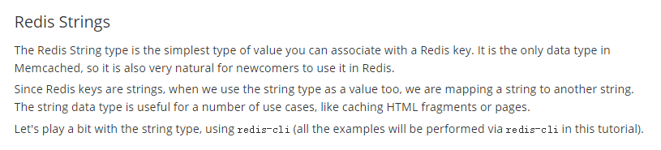
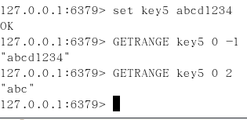
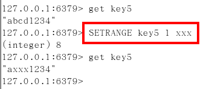
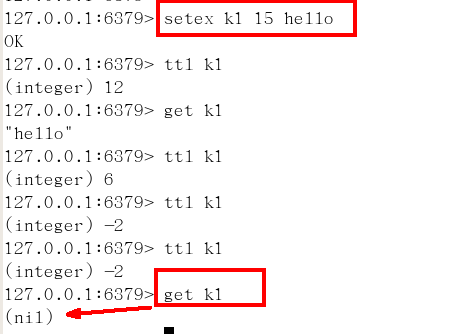
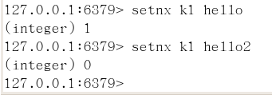
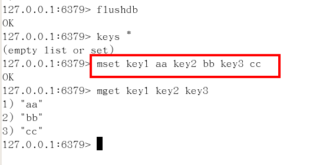
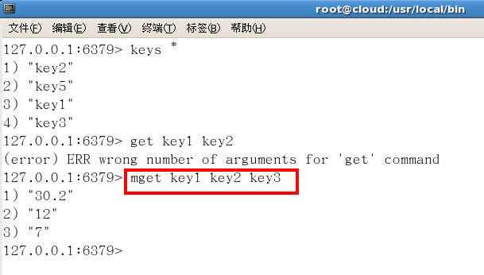
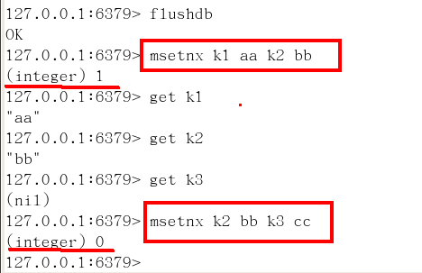
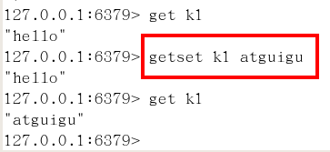

# Redis数据类型

## Redis的五大数据类型

### String（字符串）

string是redis最基本的类型，你可以理解成与Memcached一模一样的类型，一个key对应一个value。

string类型是二进制安全的。意思是redis的string可以包含任何数据。比如jpg图片或者序列化的对象 。

string类型是Redis最基本的数据类型，一个redis中字符串value最多可以是512M

### Hash（哈希，类似java里的Map）

Redis hash 是一个键值对集合。
Redis hash是一个string类型的field和value的映射表，hash特别适合用于存储对象。

类似Java里面的Map<String,Object>

### List（列表）

Redis 列表是简单的字符串列表，按照插入顺序排序。你可以添加一个元素导列表的头部（左边）或者尾部（右边）。
它的底层实际是个链表

### Set（集合）

Redis的Set是string类型的无序集合。它是通过HashTable实现实现的，

### Zset(sorted set：有序集合)

Redis zset 和 set 一样也是string类型元素的集合,且不允许重复的成员。
不同的是每个元素都会关联一个double类型的分数。
redis正是通过分数来为集合中的成员进行从小到大的排序。zset的成员是唯一的,但分数(score)却可以重复。

### 哪里去获得redis常见数据类型操作命令
Http://redisdoc.com/

## Redis 键(key)

### 常用

### 案例

* keys *

* exists key的名字，判断某个key是否存在

* move key db   --->当前库就没有了，被移除了

* expire key 秒钟：为给定的key设置过期时间

* ttl key 查看还有多少秒过期，-1表示永不过期，-2表示已过期

* type key 查看你的key是什么类型

## Redis字符串(String)

### 常用

### 单值单value

### 案例

* set/get/del/append/strlen

* Incr/decr/incrby/decrby,一定要是数字才能进行加减

* getrange/setrange

  getrange:获取指定区间范围内的值，类似between......and的关系
  从零到负一表示全部

  

  setrange设置指定区间范围内的值，格式是setrange key值 具体值

  

* setex(set with expire)键秒值/setnx(set if not exist)

  setex:设置带过期时间的key，动态设置。

  setex 键 秒值 真实值

  

  setnx:只有在 key 不存在时设置 key 的值。

  

* mset/mget/msetnx

  mset:同时设置一个或多个 key-value 对。

  

  mget:获取所有(一个或多个)给定 key 的值。

  

  msetnx:同时设置一个或多个 key-value 对，当且仅当所有给定 key 都不存在。

  

* getset(先get再set)

  getset:将给定 key 的值设为 value ，并返回 key 的旧值(old value)。
  简单一句话，先get然后立即set

  
