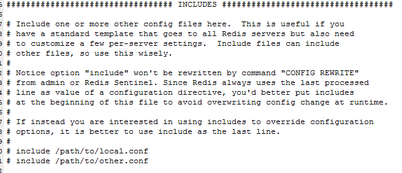

# 解析配置文件 redis.conf

## Units单位

1. 配置大小单位,开头定义了一些基本的度量单位，只支持bytes，不支持bit
2. 对大小写不敏感

## INCLUDES包含

和我们的Struts2配置文件类似，可以通过includes包含，redis.conf可以作为总闸，包含其他

## GENERAL通用

* Daemonize
* Pidfile
* Port
* Tcp-backlog

  设置tcp的backlog，backlog其实是一个连接队列，backlog队列总和=未完成三次握手队列 + 已经完成三次握手队列。
  在高并发环境下你需要一个高backlog值来避免慢客户端连接问题。注意Linux内核会将这个值减小到/proc/sys/net/core/somaxconn的值，所以需要确认增大somaxconn和tcp_max_syn_backlog两个值
  来达到想要的效果

* Timeout
* Bind
* Tcp-keepalive

  单位为秒，如果设置为0，则不会进行Keepalive检测，建议设置成60

* Loglevel

* Logfile

* Syslog-enabled

  是否把日志输出到syslog中

* Syslog-ident

  指定syslog里的日志标志

* Syslog-facility

  指定syslog设备，值可以是USER或LOCAL0-LOCAL7

* Databases
